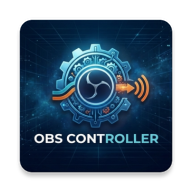
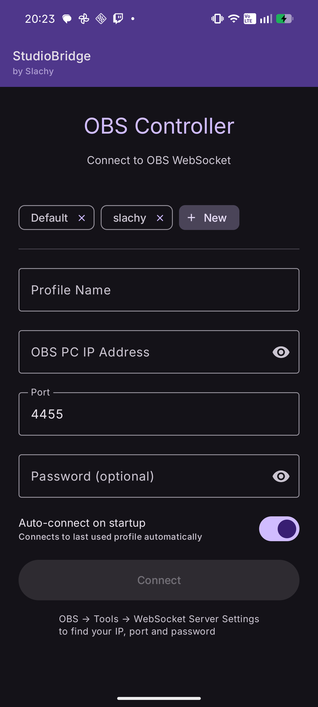
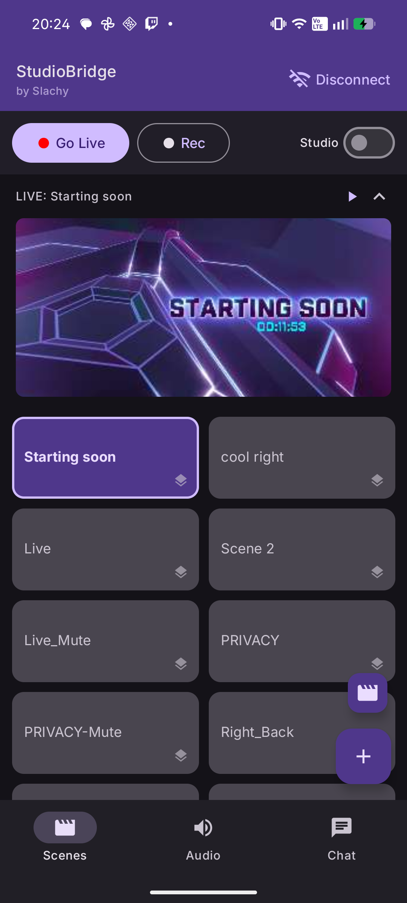
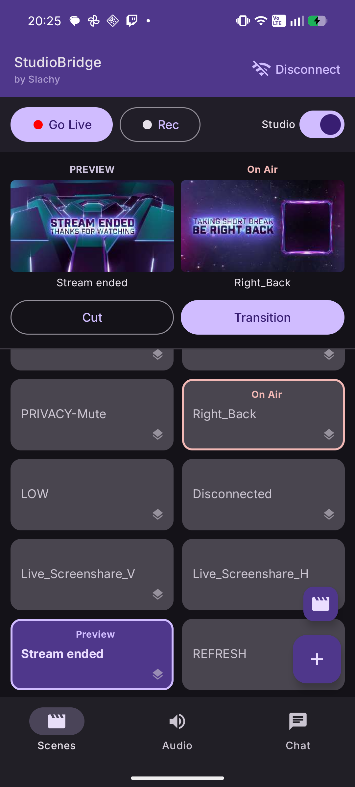
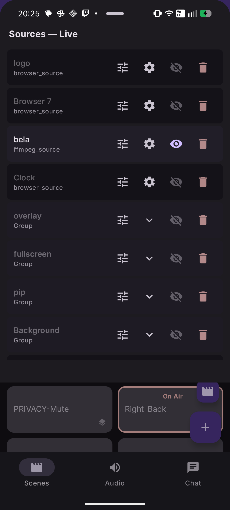
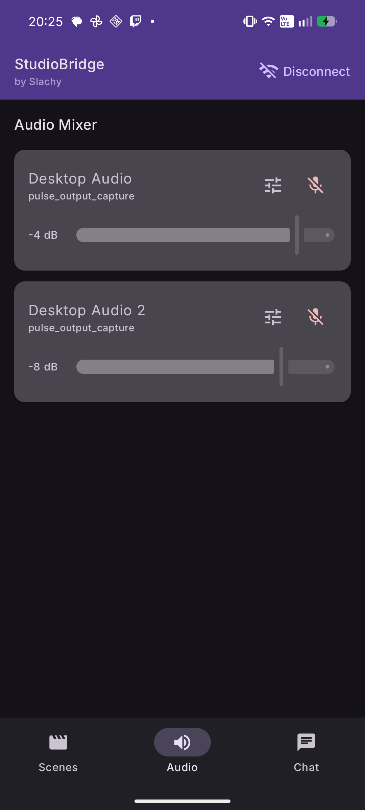
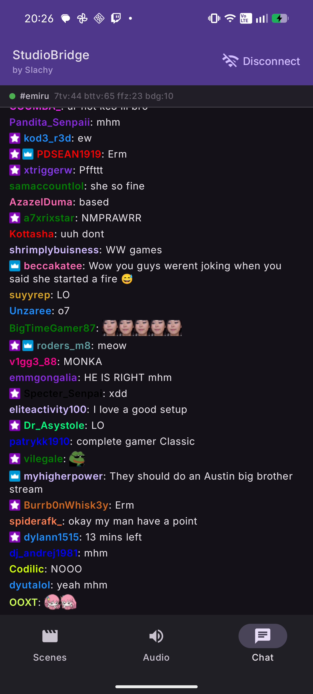

  

<h1>OBS Controller</h1>

OBS Controller 是一款繁體中文 Android 的應用程式，

可作為 OBS Studio 的全功能遙控器，讓您直接透過手機完整掌控直播或錄影。
  
專為實況主、內容創作者和工作室環境而設計，可讓您管理場景、來源、音訊和濾鏡，無需在直播過程中操作電腦。

  
  
  

  
  
  

## 功能

### 🎬 場景控制
- 在直播或錄影時快速切換場景。

### 🧩 來源管理
- 即時新增、移除、啟用或停用來源，讓您的製作保持彈性與靈活性。

### 🎚️ 音訊控制
- 控制音訊音量、將來源靜音或取消靜音，並遠端管理您的混音。

### 🎛️ 音訊與視訊濾鏡
- 直接透過手機新增、移除及設定音訊和視訊濾鏡。

- 即時調整濾鏡數值以微調音訊效果與視訊外觀，且不會中斷您的直播。

### 📡 遠端控制
- 將您的 Android 裝置作為 OBS Studio 可靠的遙控器，無論您是在同一個網路內還是進行遠端連線。

### 聊天室閱讀
- Twitch、Youtube 聊天室顯示。

- Text-to-Speech聊天訊息朗讀。

- Twitch 直播資訊 (觀看人數、直播時長) 顯示。

- Twitch 頻道公告、連續觀看紀錄、訂閱、揪團及其他特殊訊息顯示。

## 使用情境
- 實況直播
- 內容創作
- 工作室與多螢幕設置
- 現場活動與錄影
- 區域網路外的遠端直播控制

連線方式
OBS Controller 可以透過兩種方式連線至 OBS Studio：
- 區域網路連線：提供低延遲控制
- 遠端連線：透過通訊埠轉發（Port Forwarding），允許從任何地方進行控制

系統需求
- Android 裝置
- 已啟用 WebSocket 支援的 OBS Studio
